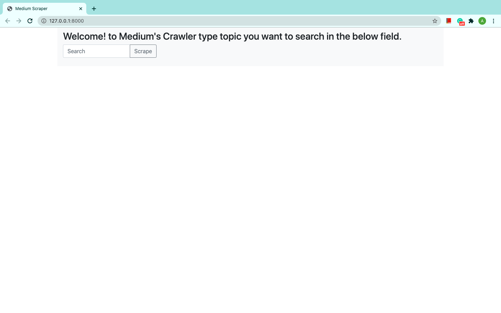
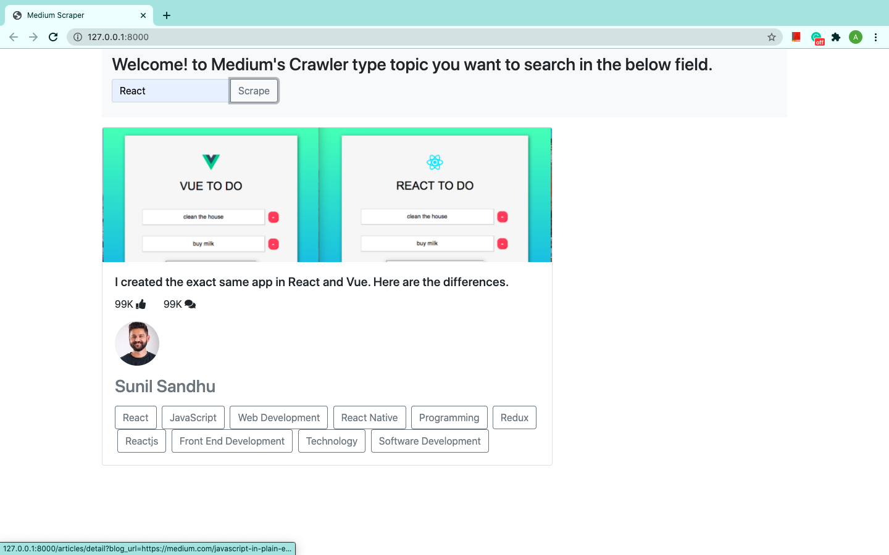
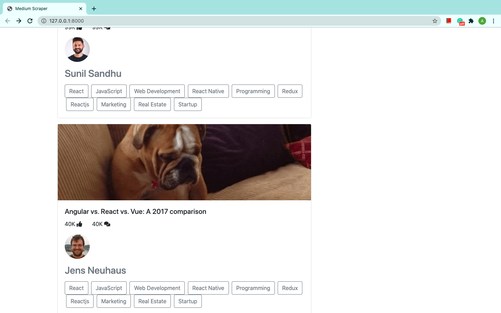
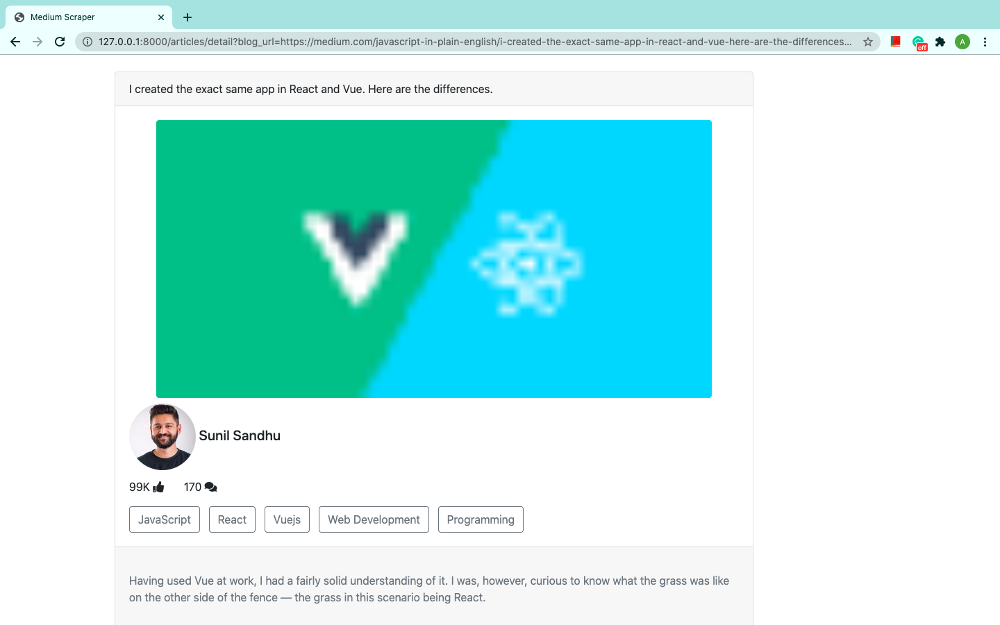
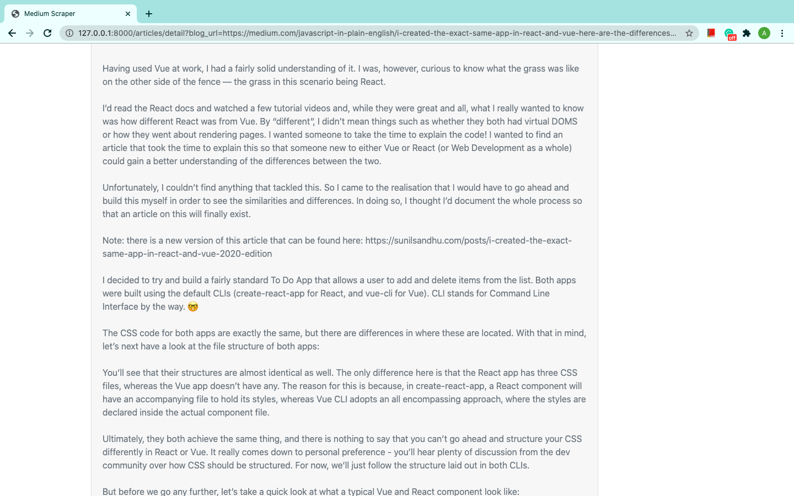
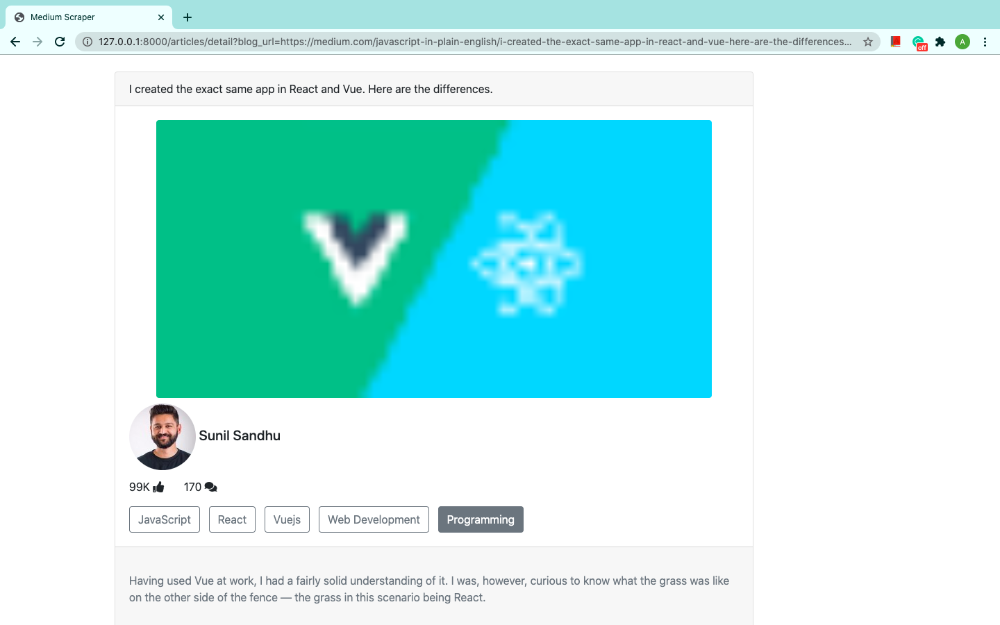
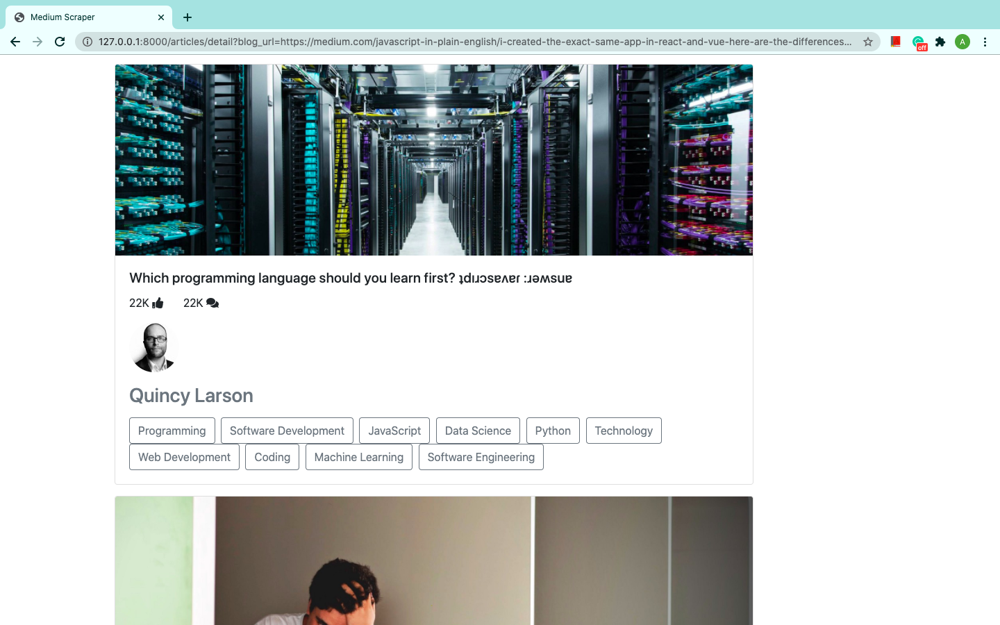

# Medium Scrapper

A Django based web application system, scraping articles from [Medium's Official website](https://medium.com/).

## Getting Started

These instructions will get you a copy of the project up and running on your local machine for development and testing purposes.

### Prerequisites

Clone the repository and open in any code editior, open the terminal and create a fresh virtual environment by typing following command. Then activate it by the next command.

#### On Windows
```python
py -m venv env

.\env\Scripts\activate
```
#### On Mac
```python
python3 -m venv env

cd env

source env/bin/activate
```

### Installing

After successfully activating virtual environment
type the following command to install all requirements for starting the project.

```python
pip install -r requirements.txt
```

At this stage you have successfully done with the installation of project, it is ready to run now with one step remaining i.e., creating database go into `medium_scrapper/settings.py` and check the database name and create the same database in you PostgreSQL application (don't forget to change the password) as mentioned in below code snippet.

```python
DATABASES = {
    'default': {
        'ENGINE': 'django.db.backends.postgresql',
        'NAME': 'medium_scraper', [ create database of same name ]
        'USER': get_env_value('DB_USER'),  [ posgresql username ]
        'PASSWORD': get_env_value('DB_PASSWORD'), [ Your password ]
        'HOST': 'localhost',
        'PORT': '5432',
    }
}
```

The above code will require to set Environment Variables into your system, if you are using PyCharm you can use the configuration option available to set the headers. In that headers you add two entries:
1. 'DB_USER' and it's value to your PostgreSQL database username.
2. 'DB_PASSWORD' and it's value to your PostgreSQL database password.
After setting the headers write the below code to import the configured Environment Variables.

```python
def get_env_value(variable_name):
    variable_value = os.environ.get(variable_name)
    if variable_value is None:
        raise ImproperlyConfigured('{} environment variable is not set'.format(variable_name))
    return variable_value
```
After configuring your database settings finally run below two commands for making tables required to run the project.

```python
python manage.py makemigrations

python manage.py migrate
```
This will successfully create tables in the database and you can check those tables in you database.
 To run the project type:
 ```python
python manage.py runserver

# then visit below url in your browser:
http://127.0.0.1:8000/
```
And guess what you have successfully configured this system to run on you machine.

## Screenshots of Pages

### Home Page:

This page allows you to search for any topic, the result will be scraped from [Medium's Official website](https://medium.com/).



### Results:

Results are scraped in real-time from [Medium](https://medium.com/) i.e., as soon as one article is scraped that gets diplayed on front-end.



As soon as the article in above screenshot is scraped it starts scraping another article then that gets scraped and then it comes to front-end as in the below screenshot.



The above process of scraping continues for ten articles.

### Details:

On clicking image of any scraped article it displays the detail page of that respective article which is already scraped and stored in the database.



Not only the Article image, heading, creator name and image, likes and responses, tags but also paragraphs (basically whole details of the article is scraped). Below screenshot contains the detail of the article.



### Tags:

The tags (Programming, Web Development, React, JavaScript) present on list of article or inside detail page are also click able and after clicking the tag articles are crawled based on the clicked tag respectively.
In the below screenshot I have selected Programming and in the subsequent screenshot articles of that tags are scraped.





### Changing time for Scraping:

The time for scraping is set to 1 second so the articles are scrawled each after a second.
This can be changed by replacing the amount of seconds in the below code in `medium_scrapper/settings.py` on line `135` to the desired seconds.

```python
SCRAPING_SLEEP_TIME = 1 [ To desired seconds ]
```


